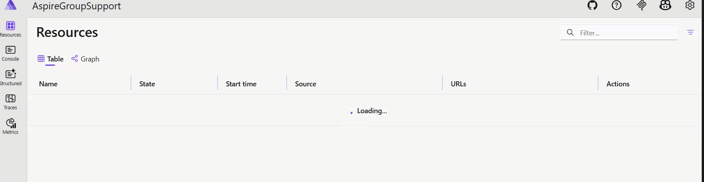
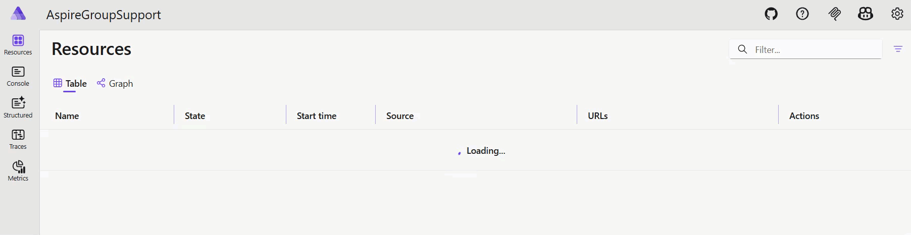

# Aspire

This solution demonstrates Aspire hosting setups with custom extensions.

## AspireGroupSupport

This project demonstrates group aggregation of child resource with combined states. It uses the custom extensions from this repository with services that watch child resources, compute an aggregate status (e.g., Running, Starting, Finished), and publish updates to parent resources.

Key components:
- `AddGroup`: Create an aribitrary group as placeholder or child resources.
- `AggregateStatusFromChildrenService`: Observes child resource snapshots and derives a parent state.
- Known resource states: `Running`, `Starting`, `Waiting`, `NotStarted`, `Active`, `Finished`, and failure-related states.
- Notifications: Publishes aggregated updates so parent resources reflect the latest child states.

Usage:
- Run the solution in Visual Studio or `aspire run` from root.

```csharp
var step1 = builder.AddExecutable("step1", "powershell.exe", builder.AppHostDirectory)
    .WithArgs(
        "-NoLogo",
        "-NoProfile",
        "-NonInteractive",
        "-ExecutionPolicy", "Bypass",
        "-Command",
        "Write-Host 'Setup...'; Start-Sleep -Seconds 3; Write-Host 'Done.'");

var step2 = builder.AddExecutable("step2", "powershell.exe", builder.AppHostDirectory)
    .WithArgs(
        "-NoLogo",
        "-NoProfile",
        "-NonInteractive",
        "-ExecutionPolicy", "Bypass",
        "-Command",
        "Write-Host 'Setup...'; Start-Sleep -Seconds 6; Write-Host 'Done.'");

builder.AddGroup("my-group")
    .WithChildRelationship(step1)
    .WithChildRelationship(step2);
```





```csharp
var step2 = builder.AddExecutable("step2", "powershell.exe", builder.AppHostDirectory)
    .WithArgs(
        "-NoLogo",
        "-NoProfile",
        "-NonInteractive",
        "-ExecutionPolicy", "Bypass",
        "-Command",
        "Write-Host 'Setup...'; Start-Sleep -Seconds 6; Write-Error 'Step2 failed'; exit 1");
```

