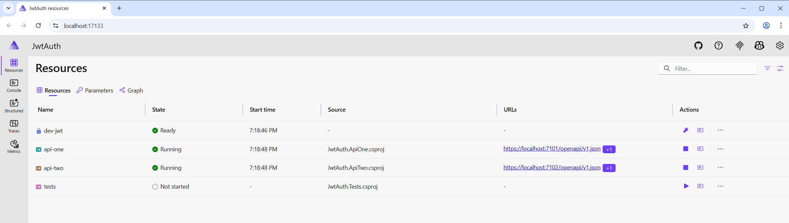
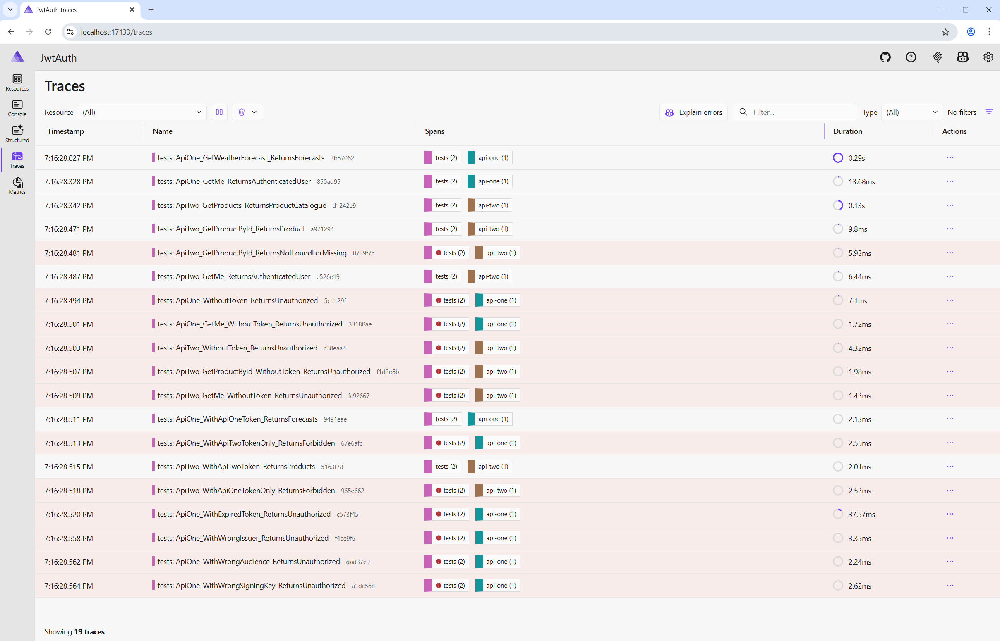
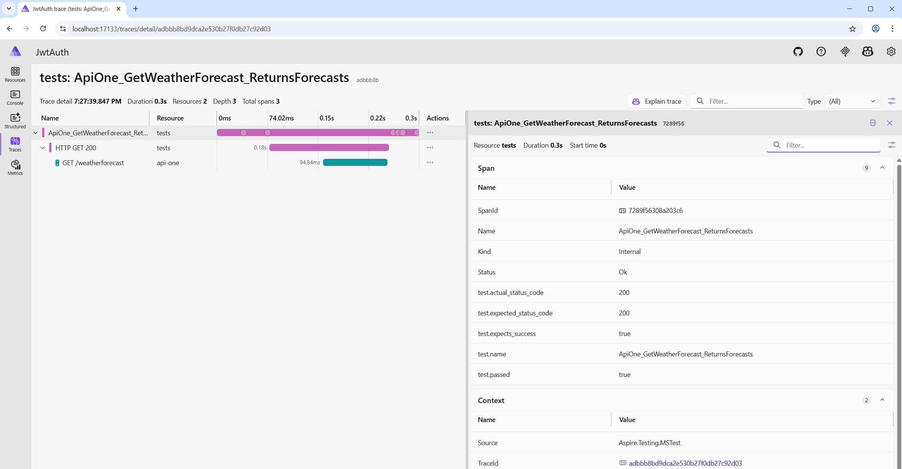
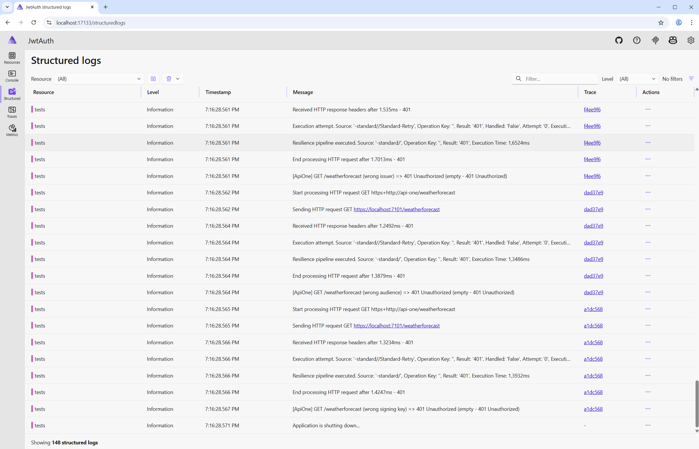
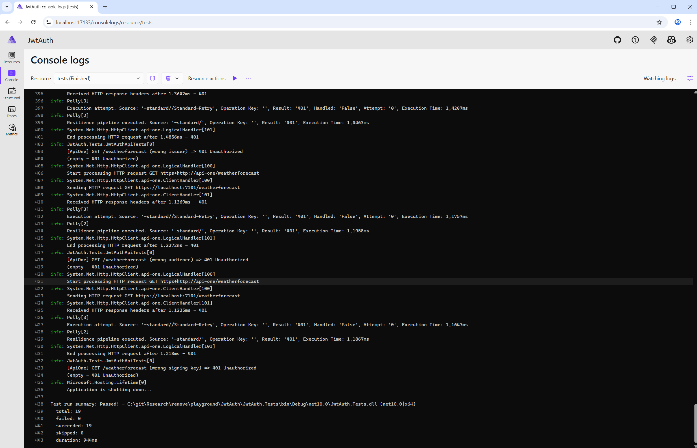
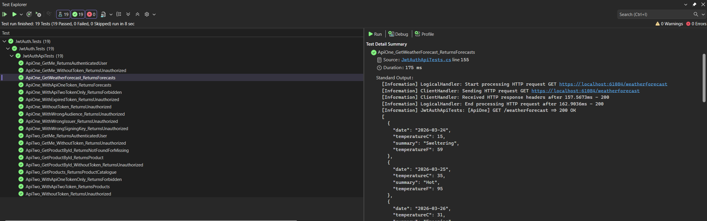
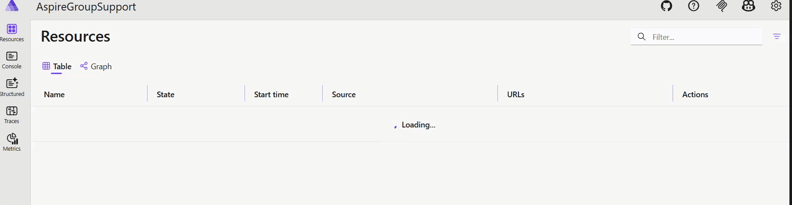
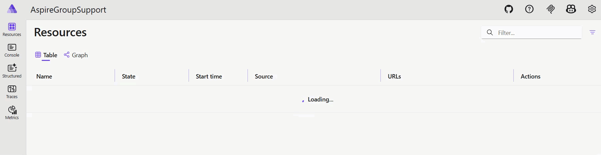

# Aspire

This solution demonstrates Aspire hosting setups with custom extensions.

## Aspire.Testing.MSTest

A reusable library providing `AspireIntegrationTestHost` — an `IHost` implementation with a fluent builder API for Aspire integration tests. It supports dual-mode execution:

- **AppHost mode** — when launched by the Aspire orchestrator, the host uses Aspire service-discovery URIs for named `HttpClient` instances.
- **Standalone mode** — when launched from Test Explorer, ReSharper, or CI, the host builds and starts a `DistributedApplication` itself, waits for resources, and resolves endpoints directly.

### Usage

```csharp
var testHost = await AspireIntegrationTestHost.CreateBuilder()
    .WithResource("api-one")
    .WithResource("api-two")
    .WithActivitySource("MyTests")
    .WithServiceDefaults(builder => builder.AddServiceDefaults())
    .WithStandaloneBuilder(() =>
        DistributedApplicationTestingBuilder.CreateAsync<MyAppHost>())
    .BuildAsync();

await testHost.StartAsync();

// IHost.Services — no indirection needed
var client = testHost.CreateClient("api-one");

// Cleanup
await testHost.DisposeAsync();
```

Key features:
- Implements `IHost` and `IAsyncDisposable` for standard compatibility
- Fluent builder via `AspireIntegrationTestHost.CreateBuilder()`
- Automatic mode detection (checks `OTEL_EXPORTER_OTLP_ENDPOINT` by default)
- Named `HttpClient` registration with service-discovery or direct endpoint resolution
- OpenTelemetry activity source registration for test span visibility
- Dev-cert bypass for HTTPS endpoints with self-signed certificates
- Startup log buffering with `FlushStartupLog()` for proper test output attribution

### After startup



### Executing tests can be done repeatedly by clicking the manual start button, this works both in debug as in normal execution.



Test expectations and outcomes are logged as details



Full structured logging from tests



Console logs in Aspire show full test output



Executing the same tests from the Test Explorer in Visual Studio gives the same results. This can be used to run integration tests in the pipelines.



## AspireGroupSupport

This project demonstrates group aggregation of child resource with combined states. It uses the custom extensions from this repository with services that watch child resources, compute an aggregate status (e.g., Running, Starting, Finished), and publish updates to parent resources.

Key components:
- `AddGroup`: Create an aribitrary group as placeholder or child resources.
- `AggregateStatusFromChildrenService`: Observes child resource snapshots and derives a parent state.
- Known resource states: `Running`, `Starting`, `Waiting`, `NotStarted`, `Active`, `Finished`, and failure-related states.
- Notifications: Publishes aggregated updates so parent resources reflect the latest child states.

Usage:
- Run the solution in Visual Studio or `aspire run` from root.

```csharp
var step1 = builder.AddExecutable("step1", "powershell.exe", builder.AppHostDirectory)
    .WithArgs(
        "-NoLogo",
        "-NoProfile",
        "-NonInteractive",
        "-ExecutionPolicy", "Bypass",
        "-Command",
        "Write-Host 'Setup...'; Start-Sleep -Seconds 3; Write-Host 'Done.'");

var step2 = builder.AddExecutable("step2", "powershell.exe", builder.AppHostDirectory)
    .WithArgs(
        "-NoLogo",
        "-NoProfile",
        "-NonInteractive",
        "-ExecutionPolicy", "Bypass",
        "-Command",
        "Write-Host 'Setup...'; Start-Sleep -Seconds 6; Write-Host 'Done.'");

builder.AddGroup("my-group")
    .WithChildRelationship(step1)
    .WithChildRelationship(step2);
```





```csharp
var step2 = builder.AddExecutable("step2", "powershell.exe", builder.AppHostDirectory)
    .WithArgs(
        "-NoLogo",
        "-NoProfile",
        "-NonInteractive",
        "-ExecutionPolicy", "Bypass",
        "-Command",
        "Write-Host 'Setup...'; Start-Sleep -Seconds 6; Write-Error 'Step2 failed'; exit 1");
```

