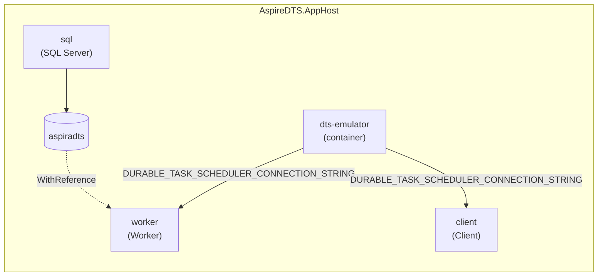

# AspireDTS Playground

A .NET Aspire playground that demonstrates how to wire up the [Azure Durable Task Scheduler (DTS)](https://learn.microsoft.com/en-us/azure/azure-functions/durable/durable-task-scheduler/durable-task-scheduler) emulator and a SQL Server database for local development.

The orchestration backend runs as a plain container (`AddContainer`) because no first-class Aspire integration for DTS exists yet. The gRPC connection string is composed dynamically from Aspire endpoint references so the worker and client receive a fully resolved address regardless of which port Aspire assigns.

## Architecture



## Projects

| Project | Description |
|---|---|
| **AspireDTS.AppHost** | Aspire orchestrator. Registers the DTS emulator container, SQL Server, the worker, and the client. |
| **AspireDTS.Worker** | .NET Worker Service. Registers `HelloOrchestrator` and `SayHelloActivity` with the DTS backend using `UseDurableTaskScheduler`. |
| **AspireDTS.Client** | .NET Worker Service. Schedules a `HelloOrchestrator` instance against the DTS backend, waits for it to complete, and logs the result. Starts with `WithExplicitStart`. |
| **AspireDTS.ServiceDefaults** | Shared Aspire service defaults (OpenTelemetry, health checks). |

## AppHost Configuration

```csharp
// Azure Durable Task Scheduler emulator for local development
var dts = builder.AddContainer("dts-emulator", "mcr.microsoft.com/dts/dts-emulator", "latest")
    .WithEndpoint(name: "grpc", targetPort: 8080)
    .WithHttpEndpoint(name: "http", targetPort: 8081)
    .WithHttpEndpoint(name: "dashboard", targetPort: 8082)
    .ExcludeFromManifest();

var grpcEndpoint = dts.GetEndpoint("grpc");
var dtsConnectionString = ReferenceExpression.Create(
    $"Endpoint=http://{grpcEndpoint.Property(EndpointProperty.Host)}:{grpcEndpoint.Property(EndpointProperty.Port)};TaskHub=default;Authentication=None");

// SQL Server with a persistent lifetime so data survives AppHost restarts
var sql = builder.AddSqlServer("sql")
    .WithLifetime(ContainerLifetime.Persistent);

var db = sql.AddDatabase("aspiradts");

// Worker service – receives the DTS connection string and SQL database reference
builder.AddProject<Projects.AspireDTS_Worker>("worker")
    .WithReference(db)
    .WaitFor(sql)
    .WithEnvironment("DURABLE_TASK_SCHEDULER_CONNECTION_STRING", dtsConnectionString)
    .WaitFor(dts);

// Client service – schedules orchestrations against the DTS
builder.AddProject<Projects.AspireDTS_Client>("client")
    .WithEnvironment("DURABLE_TASK_SCHEDULER_CONNECTION_STRING", dtsConnectionString)
    .WaitFor(dts)
    .WithExplicitStart();
```

## DTS Emulator Endpoints

| Name | Target Port | Purpose |
|---|---|---|
| `grpc` | 8080 | gRPC endpoint used by the worker and client to connect to DTS |
| `http` | 8081 | HTTP endpoint |
| `dashboard` | 8082 | Built-in DTS emulator dashboard for inspecting orchestration state |

The connection string is built from the resolved `grpc` endpoint host and port and includes `TaskHub=default;Authentication=None` for the emulator. `ExcludeFromManifest()` keeps the container out of the Azure deployment manifest since it is local-only.

## Worker

```csharp
builder.Services.AddDurableTaskWorker(workerBuilder =>
{
    workerBuilder.UseDurableTaskScheduler(dtsConnectionString);
    workerBuilder.AddTasks(registry =>
    {
        registry.AddOrchestrator<HelloOrchestrator>();
        registry.AddActivity<SayHelloActivity>();
    });
});
```

### `HelloOrchestrator`

Calls `SayHelloActivity` for Tokyo, London, and the input city **in parallel** using `Task.WhenAll`, then joins the results.

```csharp
var results = await Task.WhenAll(
    context.CallActivityAsync<string>(nameof(SayHelloActivity), "Tokyo"),
    context.CallActivityAsync<string>(nameof(SayHelloActivity), "London"),
    context.CallActivityAsync<string>(nameof(SayHelloActivity), input));

return string.Join(" ", results);
```

### `SayHelloActivity`

Returns `"Hello, {city}!"` and logs the city name.

## Client

The client uses the `AzureManaged` DurableTask client to connect to the same DTS emulator endpoint:

```csharp
builder.Services.AddDurableTaskClient(clientBuilder =>
{
    clientBuilder.UseDurableTaskScheduler(dtsConnectionString);
});
```

On startup it schedules a `HelloOrchestrator` instance with `"World"` as input, waits for completion, and logs the output.

## Package Additions

| Package | Used by | Purpose |
|---|---|---|
| `Aspire.Hosting.SqlServer` | AppHost | SQL Server container hosting |
| `Microsoft.DurableTask.Worker.AzureManaged` | Worker | DTS-native worker with `UseDurableTaskScheduler` |
| `Microsoft.DurableTask.Client.AzureManaged` | Client | DTS-native client with `UseDurableTaskScheduler` |
| `Microsoft.Data.SqlClient` | Worker | SQL Server connectivity |

## Prerequisites

- .NET 10 SDK
- Docker (for the DTS emulator and SQL Server containers)
