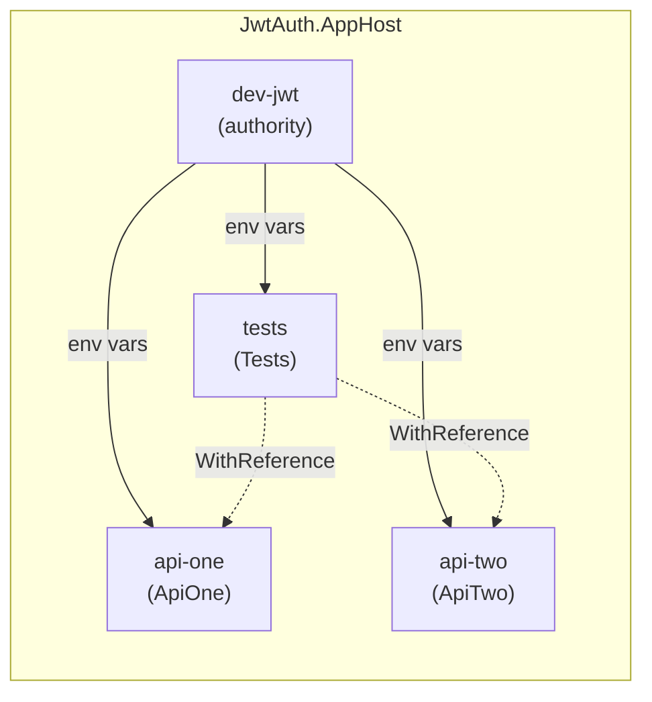

# JwtAuth Playground

[See Article](https://www.ewartnijburg.nl/go/544ce9)

A .NET Aspire playground that demonstrates shared JWT bearer authentication across multiple API services, with an integration test project orchestrated by the AppHost.

## Architecture



The AppHost creates a shared development JWT authority (`dev-jwt`) and distributes its signing key, issuer, and audience to all services and the test project via environment variables.

## Projects

| Project | Description |
|---|---|
| **JwtAuth.AppHost** | Aspire orchestrator. Registers the JWT authority, both APIs, and the test project. |
| **JwtAuth.ApiOne** | Minimal API with `/weatherforecast` and `/me` endpoints, protected by `[Authorize(Roles = "api-one")]`. |
| **JwtAuth.ApiTwo** | Minimal API with `/products`, `/products/{id}`, and `/me` endpoints, protected by `[Authorize(Roles = "api-two")]`. |
| **JwtAuth.Tests** | MSTest integration tests that run against both APIs using pre-minted JWTs. Supports both AppHost-orchestrated and standalone execution via `AspireIntegrationTestHost`. |
| **JwtAuth.ServiceDefaults** | Shared Aspire service defaults (OpenTelemetry, resilience, service discovery). |
| **Aspire.Hosting.DevJwt** | Reusable library providing the `AddSharedDevJwtAuthority`, `AddJwtProject`, `WithSharedDevJwt`, `WithNewDevJwtToken`, `WithCurrentDevJwtToken`, and `WithDevJwtProfileToken` extension methods, plus the dashboard "Generate JWT" command with named profile support. |
| **Aspire.Testing.MSTest** | Reusable library providing `AspireIntegrationTestHost` — an `IHost` implementation with a fluent builder API for Aspire integration tests. Supports dual-mode execution (AppHost-orchestrated and standalone). |

## How JWT Authentication Works

1. **Key generation** — `AddSharedDevJwtAuthority()` checks the AppHost's user-secrets for a signing key (`DevJwt:SigningKey`). If none exists, a 256-bit HMAC-SHA256 key is generated and persisted automatically.

2. **Environment variable injection** — `WithSharedDevJwt(devJwt)` (or the shorthand `AddJwtProject`) injects these environment variables into each service:

   | Variable | Example value |
   |---|---|
   | `Authentication__Schemes__Bearer__ValidIssuer` | `https://dev-jwt.local` |
   | `Authentication__Schemes__Bearer__ValidAudiences__0` | `microservices-dev` |
   | `Authentication__Schemes__Bearer__SigningKeys__0__Issuer` | `https://dev-jwt.local` |
   | `Authentication__Schemes__Bearer__SigningKeys__0__Value` | *(base64 key)* |

3. **Bearer validation** — Each API calls `builder.Services.AddAuthentication().AddJwtBearer()` with no extra configuration. ASP.NET Core's `JwtBearerOptions` auto-binds from the `Authentication:Schemes:Bearer:*` configuration keys, which are populated by the environment variables above.

4. **Token injection** — `WithNewDevJwtToken(devJwt, ...)` mints a signed JWT at orchestration time and injects it as the `DevJwt__BearerToken__{name}` environment variable. The dashboard's "Generate JWT" command and `JwtTokenFactory.CreateToken(...)` can also produce tokens from the same key.

5. **Dashboard token pass-through** — `WithCurrentDevJwtToken(devJwt)` reads the most recently generated JWT from user-secrets (`DevJwt:Tokens:Current`) and injects it as the default `DevJwt__BearerToken` environment variable. This lets the test project use a token generated interactively via the dashboard.

6. **Profile-based token injection** — `WithDevJwtProfileToken(devJwt, profile, ...)` reads a saved profile's claims from user-secrets (`DevJwt:Profiles:{profile}:*`) and mints a fresh JWT at orchestration time. Profiles are created and managed via the dashboard's "Generate JWT" command.

7. **Dashboard visibility** — The `dev-jwt` resource displays its Issuer, Audience, SigningKey, and BearerToken as environment variables in the Aspire dashboard's resource details panel. The SigningKey and BearerToken values are shown with the built-in show/hide masking toggle.

## API Endpoints

### ApiOne (`api-one`)

| Method | Path | Auth | Description |
|---|---|---|---|
| GET | `/weatherforecast` | Bearer (`api-one` role) | Returns 5 random weather forecasts. |
| GET | `/me` | Bearer (`api-one` role) | Returns the authenticated user's claims with `"service": "ApiOne"`. |

### ApiTwo (`api-two`)

| Method | Path | Auth | Description |
|---|---|---|---|
| GET | `/products` | Bearer (`api-two` role) | Returns the full product catalogue. |
| GET | `/products/{id}` | Bearer (`api-two` role) | Returns a single product or 404. |
| GET | `/me` | Bearer (`api-two` role) | Returns the authenticated user's claims with `"service": "ApiTwo"`. |

## Test Project

`JwtAuth.Tests` is an MSTest project that supports two execution modes:

- **AppHost mode** — launched by the Aspire orchestrator. Tokens and JWT authority config are injected as environment variables.
- **Standalone mode** — launched from Test Explorer, ReSharper, or CI. The test builds and starts the AppHost's `DistributedApplication` itself, waits for resources to be ready, and mints tokens locally.

Mode detection is automatic: if `OTEL_EXPORTER_OTLP_ENDPOINT` is set (which the Aspire orchestrator always provides), the test runs in AppHost mode; otherwise it falls back to standalone.

### `AspireIntegrationTestHost` Builder Pattern

The test uses `AspireIntegrationTestHost` (from `Aspire.Testing.MSTest`) which implements `IHost` and provides a fluent builder API:

```csharp
_testHost = await AspireIntegrationTestHost.CreateBuilder()
    .WithResource("api-one")
    .WithResource("api-two")
    .WithActivitySource(TracedTestMethodAttribute.TestActivitySource.Name)
    .WithServiceDefaults(builder => builder.AddServiceDefaults())
    .WithStandaloneBuilder(async () =>
    {
        var appHostAssembly = Assembly.Load("JwtAuth.AppHost");
        var entryPointType = appHostAssembly.EntryPoint?.DeclaringType
            ?? throw new InvalidOperationException("...");
        return await DistributedApplicationTestingBuilder.CreateAsync(entryPointType, []);
    })
    .ConfigureStandaloneBuilder(builder =>
    {
        standaloneSigningKey = builder.Configuration[SharedDevJwtAuthority.DefaultSigningKeySecret];
    })
    .BuildAsync();

await _testHost.StartAsync();
```

| Builder method | Purpose |
|---|---|
| `WithResource(name)` | Registers a named `HttpClient` for the resource. In standalone mode, also waits for the resource to reach `Running` and resolves its endpoint. |
| `WithActivitySource(name)` | Registers an OpenTelemetry activity source so test spans appear in the Aspire dashboard. |
| `WithServiceDefaults(cb)` | Applies Aspire service defaults (service discovery, resilience, OTLP) — only in AppHost mode. |
| `WithStandaloneBuilder(factory)` | Provides the factory that creates the `IDistributedApplicationTestingBuilder` for standalone mode. |
| `ConfigureStandaloneBuilder(cb)` | Further configures the testing builder in standalone mode (e.g. reading config after the AppHost code runs). |
| `ConfigureHostBuilder(cb)` | Applies additional configuration to the lightweight `IHost` builder in both modes. |
| `BuildAsync()` | Returns a configured but not-yet-started `AspireIntegrationTestHost`. |

Since `AspireIntegrationTestHost` implements `IHost`, consumers use `_testHost.Services` directly and call `StartAsync()`/`StopAsync()`/`DisposeAsync()` following the standard host contract.

### AppHost Registration

The test project is registered in the AppHost with:

- **`WithCurrentDevJwtToken(devJwt)`** — reads the most recently dashboard-generated JWT from user-secrets and injects it as the default `DevJwt__BearerToken`. This allows tests to use tokens created interactively via the Aspire dashboard's "Generate JWT" command.
- **`WithNewDevJwtToken(devJwt, ...)`** — mints a signed JWT at orchestration time and injects it as an environment variable. Called multiple times with different `name` values to provide tokens for different test scenarios (e.g. `api-one-user`, `both-user`, `api-two-user`, `noscopes`). The test reads tokens via `SharedDevJwtEnvironmentNames.GetBearerTokenName(name)`.
- **`WithReference(apiOne)` / `WithReference(apiTwo)`** — receives service endpoint URLs as `services__api-one__https__0` (and `http` fallback) environment variables.
- **`WaitFor(apiOne)` / `WaitFor(apiTwo)`** — ensures both APIs are healthy before the tests start.
- **`WithArgs("--settings", "test.runsettings")`** — passes the runsettings file to the MSTest runner so `Console.WriteLine` output flows to stdout and appears in the Aspire dashboard console logs.
- **`WithExplicitStart()`** — the test project does not auto-start with the AppHost; it must be started manually from the Aspire dashboard.
- **`EnableMSTestRunner`** — set to `true` in the `.csproj` so the project runs tests when launched as an executable (required for Aspire orchestration).
- **`test.runsettings`** — disables MSTest's `CaptureTraceOutput` (which redirects `Console.Out` into per-test buffers) so diagnostic output reaches stdout and is visible in the Aspire dashboard.

### `TracedTestMethodAttribute` Pattern

Test methods use `[TracedTestMethod]` instead of the standard `[TestMethod]`. This custom attribute wraps every test execution in an OpenTelemetry `Activity` so that each test appears as a span in the Aspire dashboard's distributed traces view.

#### Components

| Class | Role |
|---|---|
| `TracedTestMethodAttribute` | Extends `TestMethodAttribute`. Starts an `Activity` before the test runs and sets outcome tags when it completes. Accepts an optional `expectedStatusCode` (defaults to `200 OK`). |
| `TestActivityScope` | Ambient scope backed by `AsyncLocal<T>`. Allows the test body to report the observed HTTP status code back to the wrapping attribute without a direct reference. |

#### How It Works

1. `TracedTestMethodAttribute.ExecuteAsync` starts a new `Activity` on the shared `JwtAuth.Tests` `ActivitySource` and tags it with `test.name`, `test.expected_status_code`, and `test.expects_success`.
2. It opens a `TestActivityScope` and delegates to `base.ExecuteAsync` (the normal MSTest pipeline).
3. Inside the test body, `TestActivityScope.ReportStatusCode(response.StatusCode)` stores the actual HTTP status code in the `AsyncLocal` state.
4. After the test completes, the attribute reads the reported status code and compares it to `ExpectedStatusCode`:
   - **Match** → `ActivityStatusCode.Ok`, `test.passed = true`.
   - **Mismatch** → `ActivityStatusCode.Error`, `test.passed = false` with a descriptive message.
   - **No status reported** → outcome is derived from the MSTest `UnitTestOutcome`.
5. The `Activity` is disposed (ending the span), and `TestActivityScope.End()` clears the `AsyncLocal`.

#### Usage

```csharp
// Happy-path test — expects 200 OK (default)
[TracedTestMethod]
public async Task ApiOne_GetWeatherForecast_ReturnsForecasts()
{
    using var client = CreateAuthenticatedClient("api-one");
    var response = await client.GetAsync("/weatherforecast");
    Assert.AreEqual(HttpStatusCode.OK, response.StatusCode);

    TestActivityScope.ReportStatusCode(response.StatusCode);
}

// Negative test — expects 401 Unauthorized
[TracedTestMethod(HttpStatusCode.Unauthorized)]
public async Task ApiOne_WithoutToken_ReturnsUnauthorized()
{
    using var client = CreateUnauthenticatedClient("api-one");
    var response = await client.GetAsync("/weatherforecast");
    Assert.AreEqual(HttpStatusCode.Unauthorized, response.StatusCode);

    TestActivityScope.ReportStatusCode(response.StatusCode);
}
```

#### Activity Tags

| Tag | Type | Description |
|---|---|---|
| `test.name` | string | The test method name. |
| `test.expected_status_code` | int | The HTTP status code the test expects. |
| `test.expects_success` | bool | `true` when the expected status code is < 400. |
| `test.actual_status_code` | int | The HTTP status code reported by `TestActivityScope.ReportStatusCode`. |
| `test.passed` | bool | Whether the actual status code matched the expected one. |

### Test Coverage

Every endpoint on both APIs is covered by an **authenticated** (happy-path) test and an **unauthorized** (no-token → 401) test. Additional role-based tests verify that a token with only the `api-one` role is forbidden from `api-two` (and vice versa):

| Test | API | Endpoint | Token | Expected |
|---|---|---|---|---|
| `ApiOne_GetWeatherForecast_ReturnsForecasts` | ApiOne | `GET /weatherforecast` | `both-user` | 200 OK |
| `ApiOne_GetMe_ReturnsAuthenticatedUser` | ApiOne | `GET /me` | `both-user` | 200 OK |
| `ApiTwo_GetProducts_ReturnsProductCatalogue` | ApiTwo | `GET /products` | `both-user` | 200 OK |
| `ApiTwo_GetProductById_ReturnsProduct` | ApiTwo | `GET /products/1` | `both-user` | 200 OK |
| `ApiTwo_GetProductById_ReturnsNotFoundForMissing` | ApiTwo | `GET /products/9999` | `both-user` | 404 Not Found |
| `ApiTwo_GetMe_ReturnsAuthenticatedUser` | ApiTwo | `GET /me` | `both-user` | 200 OK |
| `ApiOne_WithoutToken_ReturnsUnauthorized` | ApiOne | `GET /weatherforecast` | *(none)* | 401 Unauthorized |
| `ApiOne_GetMe_WithoutToken_ReturnsUnauthorized` | ApiOne | `GET /me` | *(none)* | 401 Unauthorized |
| `ApiTwo_WithoutToken_ReturnsUnauthorized` | ApiTwo | `GET /products` | *(none)* | 401 Unauthorized |
| `ApiTwo_GetProductById_WithoutToken_ReturnsUnauthorized` | ApiTwo | `GET /products/1` | *(none)* | 401 Unauthorized |
| `ApiTwo_GetMe_WithoutToken_ReturnsUnauthorized` | ApiTwo | `GET /me` | *(none)* | 401 Unauthorized |
| `ApiOne_WithApiOneToken_ReturnsForecasts` | ApiOne | `GET /weatherforecast` | `api-one-user` | 200 OK |
| `ApiOne_WithApiTwoTokenOnly_ReturnsForbidden` | ApiOne | `GET /weatherforecast` | `api-two-user` | 403 Forbidden |
| `ApiTwo_WithApiTwoToken_ReturnsProducts` | ApiTwo | `GET /products` | `api-two-user` | 200 OK |
| `ApiTwo_WithApiOneTokenOnly_ReturnsForbidden` | ApiTwo | `GET /products` | `api-one-user` | 403 Forbidden |

### Test Flow

1. `ClassInitialize` builds an `AspireIntegrationTestHost` using the builder pattern. Mode detection happens inside `BuildAsync()` by checking the `OTEL_EXPORTER_OTLP_ENDPOINT` environment variable.

2. **AppHost mode** — the host reads pre-minted bearer tokens from environment variables injected by `WithNewDevJwtToken` at orchestration time (via `SharedDevJwtEnvironmentNames.GetBearerTokenName(name)`):
   - `both-user` → token with both `api-one` and `api-two` roles (used for happy-path tests against both APIs).
   - `api-one-user` → token with only the `api-one` role (used to verify access to ApiOne and 403 from ApiTwo).
   - `api-two-user` → token with only the `api-two` role (used to verify access to ApiTwo and 403 from ApiOne).
   - JWT authority config (signing key, issuer, audience) is read from environment variables for crafting invalid tokens in the validation tests.

3. **Standalone mode** — the host creates and starts a `DistributedApplication` from the `JwtAuth.AppHost` assembly, waits for `api-one` and `api-two` resources to reach `Running`, and resolves their endpoints directly. Tokens are minted locally using the same signing key the AppHost configured.

4. The host is started (`StartAsync`), and startup logs are flushed to `TestContext` via `FlushStartupLog()`.

5. Each test creates an `HttpClient` via `_testHost.CreateClient(serviceName)` with the appropriate bearer token and calls API endpoints.

6. `ClassCleanup` calls `DisposeAsync()` on the host, which stops the lightweight `IHost` and (in standalone mode) the `DistributedApplication`.

### Running the Tests

**AppHost mode:** Start the AppHost (F5 or `dotnet run` from `JwtAuth.AppHost`), then trigger the `tests` resource from the Aspire dashboard. The tests will execute in-process using the MSTest runner and report results back to the dashboard.

**Standalone mode:** Run the tests directly from your IDE's Test Explorer, ReSharper, or `dotnet test` from the `JwtAuth.Tests` directory. The `AspireIntegrationTestHost` will automatically detect standalone mode, build and start the AppHost's `DistributedApplication`, wait for resources, and mint tokens locally.

## Generate JWT Command and Named Profiles

The `dev-jwt` resource exposes a **Generate JWT** command in the Aspire dashboard. This command uses a two-step interactive dialog:

1. **Profile picker** — If saved profiles exist in user-secrets, a dropdown lists them alongside a "(Create new)" option. If no profiles exist, this step is skipped.
2. **JWT generation form** — Fields for Profile Name, Subject, Expiry, Roles, Scopes, and Custom Claims JSON. When editing an existing profile, all fields are pre-populated from user-secrets.

After generation:
- The token is stored in user-secrets under `DevJwt:Tokens:Current`.
- The profile's claims are persisted under `DevJwt:Profiles:{name}:*` (Subject, Expiry, Roles, Scopes, CustomClaimsJson).
- The `dev-jwt` resource's BearerToken environment variable is updated live in the dashboard.

Profiles survive across AppHost restarts because they are stored in user-secrets.

## AppHost Configuration

```csharp
// apphost.cs
var devJwt = builder.AddSharedDevJwtAuthority();

var apiOne = builder.AddJwtProject<Projects.JwtAuth_ApiOne>("api-one", devJwt);
var apiTwo = builder.AddJwtProject<Projects.JwtAuth_ApiTwo>("api-two", devJwt);

builder.AddProject<Projects.JwtAuth_Tests>("tests")
    .WithCurrentDevJwtToken(devJwt)
    .WithNewDevJwtToken(devJwt, name: "api-one-user", subject: "api-one-user", roles: ["api-one"])
    .WithNewDevJwtToken(devJwt, name: "both-user", subject: "both-user", roles: ["api-one", "api-two"])
    .WithNewDevJwtToken(devJwt, name: "api-two-user", subject: "api-two-user", roles: ["api-two"])
    .WithNewDevJwtToken(devJwt, name: "noscopes", subject: "test-bare")
    .WithReference(apiOne)
    .WithReference(apiTwo)
    .WaitFor(apiOne)
    .WaitFor(apiTwo)
    .WithArgs("--settings", "test.runsettings")
    .WithExplicitStart();
```

## Prerequisites

- .NET 10 SDK
- Aspire AppHost SDK 13.1.2
